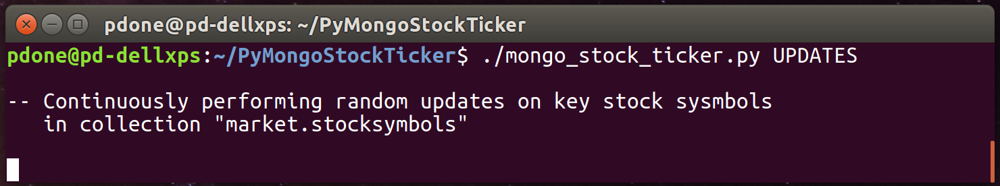
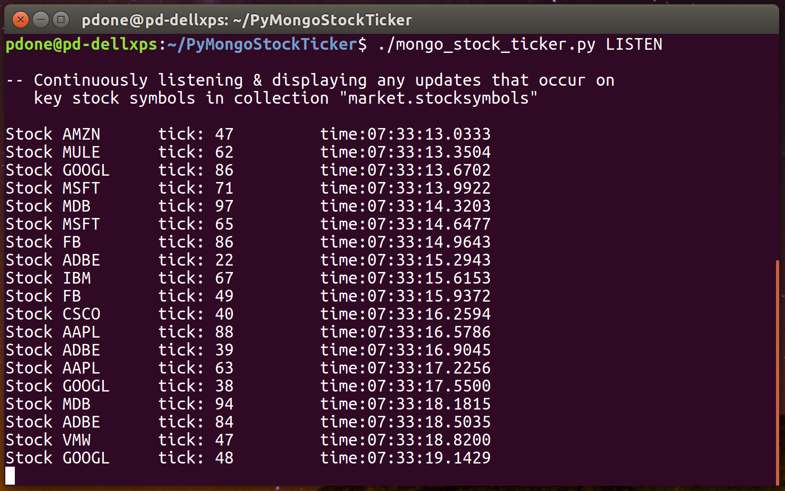

# Python 'Stock Ticker' Demo Application For MongoDB Change Streams

A Python application demonstrating MongoDB's [Change Streams](https://docs.mongodb.com/manual/changeStreams/) capability, by simulating a simple "Stock Prices" system. Changes to stock prices are listened for and displayed to the user, as and when these price changes are persisted in the MongoDB database. 

The MongoDB database/collection created and used by the Python application is: 'market.stocksymbols'.

## Prerequisites

1. A MongoDB deployment is configured, running and accessible. This can be either a MongoDB Replica Set (for an example of how to quickly run one on the same local machine see: [https://github.com/pkdone/mongo-quick-repset](https://github.com/pkdone/mongo-quick-repset)) or a Sharded Cluster (for an example of how to quickly run one on the same local machine see: [https://github.com/pkdone/mongo-multi-svr-generator](https://github.com/pkdone/mongo-multi-svr-generator)). Note: A standalone non-replicated MongoDB deployment cannot be used, as that does not support Change Streams.

2. The MongoDB Python Driver (PyMongo) is installed locally. Example:

    ```
    $ sudo pip install pymongo
    ```

## How To Run

1. In the Python script file 'mongo_stock_ticker.py', near the top of the file, change the value of the variable 'MONGODB_URL' to reflect the address of the MongoDB Replica Set or Sharded Cluster, that was established as part of the prerequisites.


    ```
    MONGODB_URL = 'mongodb://...'
    ```

2. In a command line shell, clean out any old copy of the stock prices database data that may exist, by running the Python script with the 'clean' command (not necessary for first time running the demo but doesn't do any harm if run). Example:


2. Initialise the stock prices database by running the Python script with the 'init' command. Initialises the database collection with around 2000 random stock symbol and price records, plus a handful of familiar stock symbols (eg. MDB, ORCL, GOOGL) with prices. If the target environment is a Sharded cluster, automatically enables sharding on the stock prices database collection. Example:


3. Start continuously updating records in the stock prices database collection by running the Python script with the 'updates' command (abort using 'Ctrl-C'). Performs random updates on any stock in the collection and also performs some random deletes and inserts. Executes approximately 16 operations per second, of which only 4 operations relate to updating the prices of the familiar stock symbols (eg. MDB, ORCL, GOOGL). Example:



4. In a separate command line shell, from where the executed command is still running from point 3, start continuously listening to change events on the stock prices database collection. Achieve this by running the Python script with the 'listen' command (abort using 'Ctrl-C'). This filters on only changes to the familiar stock symbol prices (eg. MDB, ORCL, GOOGL), and prints out the new value as and when any of these are changed. Example:



