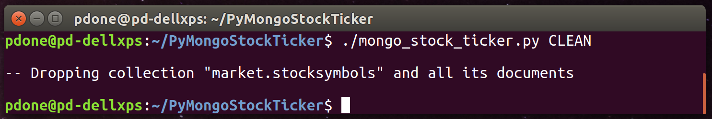
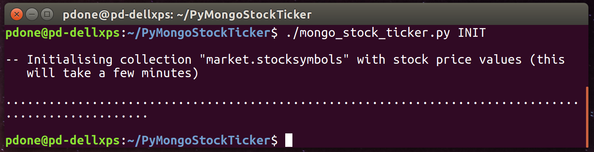
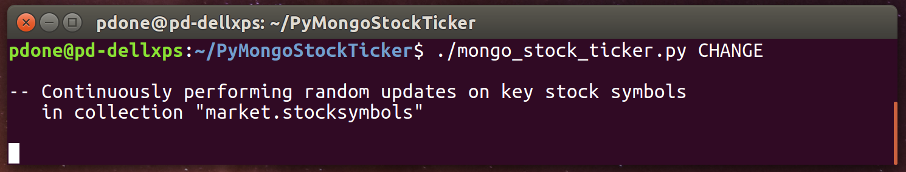
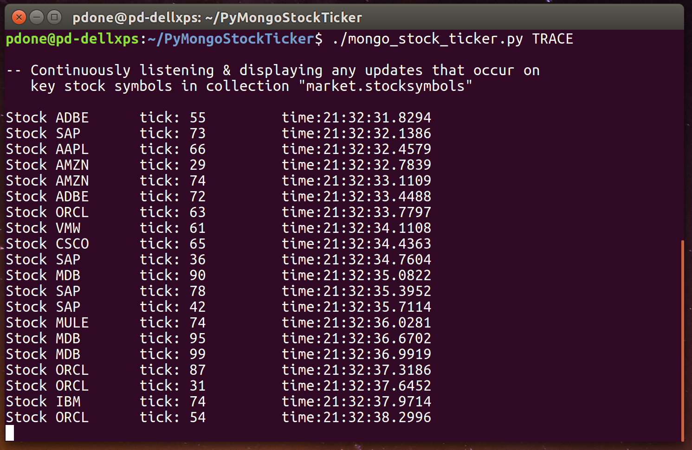
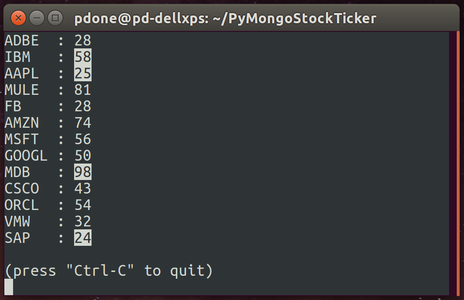

# Python 'Stock Ticker' Demo Application For MongoDB Change Streams

A Python application demonstrating MongoDB's [Change Streams](https://docs.mongodb.com/manual/changeStreams/) capability, by simulating a simple "Stock Prices" system. Changes to stock prices are listened for and displayed to the user as and when these price changes are persisted in the MongoDB database. 

The MongoDB database/collection created and used by the Python application is: 'market.stocksymbols'.

## Prerequisites

1. A MongoDB deployment is already configured, running and accessible. This can be either a MongoDB Replica Set (see [example](https://github.com/pkdone/mongo-quick-repset) of how to quickly run one on the same local machine) or a Sharded Cluster (see [example](https://github.com/pkdone/mongo-multi-svr-generator) of how to quickly run one on the same local machine). **Note:** A standalone non-replicated MongoDB deployment cannot be used, as this is not supported by the Change Streams capability.

2. The MongoDB Python Driver (PyMongo) is already installed locally. Example:

    ```
    $ sudo pip install pymongo
    ```

## How To Run

1. In the Python script file **mongo_stock_ticker.py**, near the top of the file, change the value of the variable **MONGODB_URL** to reflect the address of the MongoDB Replica Set or Sharded Cluster, that was established as part of the prerequisites.


    ```
    MONGODB_URL = 'mongodb://...'
    ```

2. Using a command line shell, clean out any old copy of the stock prices database data that may exist, by running the Python script with the **clean** command (this is not necessary for first time running the demo, but it doesn't do any harm if run). Example:





2. Initialise the stock prices database by running the Python script with the **init** command. Initialises the database collection with around 2000 random stock symbol and price records, plus a handful of familiar stock symbols (eg. MDB, ORCL, GOOGL) with prices. If the target environment is a Sharded cluster, automatically enables sharding on the stock prices database collection. Example:





3. Start continuously changing records in the stock prices database collection by running the Python script with the **change** command (abort using 'Ctrl-C'). Performs random updates on any stock in the collection and also performs some random deletes and inserts. Executes approximately 16 operations per second, of which only 4 operations relate to updating the prices of the familiar stock symbols (eg. MDB, ORCL, GOOGL). Example:





4. In a separate command line shell, from where the executed command is still running from point 3, start continuously listening to change events on the stock prices database collection and printing the changes. Run the Python script with the **trace** command to invoke this (abort using 'Ctrl-C'). This filters the database changes to listen for updates to the prices of the familiar stock symbols records only (eg. MDB, ORCL, GOOGL), and prints out each new value as and when the change occurs. Example:





5. In a separate command line shell, from where the executed command is still running from point 3, start continuously listening to change events on the stock prices database collection and showing each price change inline in the console, next to its respective stock symbol. Run the Python script with the **display** command to invoke this (abort using 'Ctrl-C'). This filters the database changes to listen for updates to the prices of the familiar stock symbols records only (eg. MDB, ORCL, GOOGL), and displays each changed value, inline, as and when the change occurs. Recently changed stock prices are highlighted for a couple of seconds. Example:





## FAQ

* Q1. In this example, why isn't the resume token saved somewhere by the client application listening process, so that if the client process crashes, client could restart from where it left off?

* A1. The client implementation is safe because it "initial syncs" every time it starts up (after getting a resume token and before watching the collection). The logic here is that these sorts of clients (not just stock tickers specifically) may only ever be interested in a small subset of data (e.g. only a few thousand of maybe billions of total records). The trade off being that the client application may not be turned on during night, for example, and when turned on each morning, it could either try to reproduce all the changes from the night before (and it could well have fallen off oplog) or it could just "initial sync" the few 10s/100s/1000s records of interest, each time, before listening. In summary, if the client is not another type of "datastore", that is usually up most of the time, and the client application is only ever interested in a small subset of records, it probably doesn't makes sense to persist the resume token and always try to catch-up. Instead, it can just resync every time.

